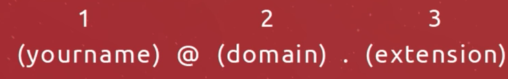

# Cyborg-Noodle

## [This](https://gist.github.com/ellysecarter/bed7352e08b3f0302391b5c155c42165) is a tutorial on how to match an email using Regex! 

## What is Regex?

A regex, which is short for regular expression, is a sequence of characters that defines a specific search pattern. When included in code or search algorithms, regular expressions can be used to find certain patterns of characters within a string, or to find and replace a character or sequence of characters within a string. They are also frequently used to validate input.

## Summary

This tutorial will show you how to validate email addresses using regex. Maybe you have a form on your website or a dialog box in your application that asks the user for an email address. You want to use a regular expression to validate this email address before trying to send email to it. This reduces the number of emails returned to you as undeliverable.

 
Let's consider the following code and break it down into sections: your name, the domain, the extension:

`^([a-z\d\.-]+)@([a-z\d-]+)\.([a-z\.]{2,8})$`
 

Your name: `([a-z\d\.-]+)`
 

the domain: `([a-z\d-]+)`
 

the extension: `([a-z\.]{2,8})`

 

## Table of Contents

- [Anchors](#anchors)
- [Quantifiers](#quantifiers)
- [Character Classes](#character-classes)
- [Flags](#flags)
- [Grouping and Capturing](#grouping-and-capturing)
- [Bracket Expressions](#bracket-expressions)

## Regex Components
 

### Anchors

Before we dive into the email, let's talk about something called anchors first. Anchors are regex tokens that don't match any characters but inform us that the engine's current position in the string matches a determined location: for example, the beginning of the string, or the end of a string.
 

`^` and `$` are the two anchors that the following code uses to express the beginning on the string and the end of the string respectively. 
 

`^([a-z\d\.-]+)@([a-z\d-]+)\.([a-z\.]{2,8})$`

 

### Quantifiers

Quantifiers specify how many instances of a character, group, or character class must be present in the input for a match to be found.
 
 

The `+` quantifier matches the preceding element one or more times. In our example we use `+` twice, in the first two code blocks:
 

your name: `([a-z\d\.-]+)`
and
the domain: `([a-z\d-]+)`

Notice that the `+` is at the end of each string. Its telling our system to match anything within the brackets one or more times.  
 

The `{n,m}` quantifier matches the preceding element at least n times, but no more than m times, where n and m are integers. 

In our example, we have `{2,8}` that follows the extension. Normally extension are at least 2 letters but no more than 8 letters so our system will match anything between 2 and 8 occurrences. 

 

### Character Classes

With a “character class” you can tell the regex engine to match only one out of several characters.
 

In our code example we use:
- `\d`
    Matches any digit. Equivalent to [0-9]. For example, `/\d/` or `/[0-9]/` matches "2" in "B2 is the suite number".
- `\`
    Indicates that the following character should be treated specially, or "escaped". For characters that are usually treated specially, indicates that the next character is not special and should be interpreted literally.
- `-`
    Range indicator. 

Below we see we want our engine to find any occurrences of letters a-z and any digit. Sometimes email address have a period or hyphen so we use `\` to find a literal period or hyphen.  
`[a-z\d\.-]`

 

### Flags
A fundamental part of regex is flags.

A regex usually comes within this form /abc/, where the search pattern is delimited by two slash characters /. At the end we can specify a flag with these values (we can also combine them each other):

- g (global) does not return after the first match, restarting the subsequent searches from the end of the previous match
- m (multi-line) when enabled `^` and `$` will match the start and end of a line, instead of the whole string
- i (insensitive) makes the whole expression case-insensitive (for instance /aBc/i would match AbC)

 

### Grouping and Capturing
To group and capture we use `()` - parenthesis. Take a quick look at our code below and see if you can identify how many groups we have?
 

`^([a-z\d\.-]+)@([a-z\d-]+)\.([a-z\.]{2,8})$`

If your answer was 3, you're right! This operator is very useful when needing to extract information from strings or data. We captured the name, the domain, and the extension by using `()`.

### Bracket Expressions
A bracket expression (an expression enclosed in square brackets, "[]") is a regex that indicates any individual character between the brackets will match. 
 

In our example, we have 3 bracket expressions. They were primarily used to separate our quantifiers from the character classes.

 

### Hopefully this tutorial has helped you understand how to validate email addresses using regex.

 

## Author

Ellyse Carter is a Sales Manager by day and a coding student by night. If you have any questions or would like to collaborate, please visit her [GitHub](https://github.com/ellysecarter) or email her at [ellyseac@gmail.com](ellyseac@gmail.com)

